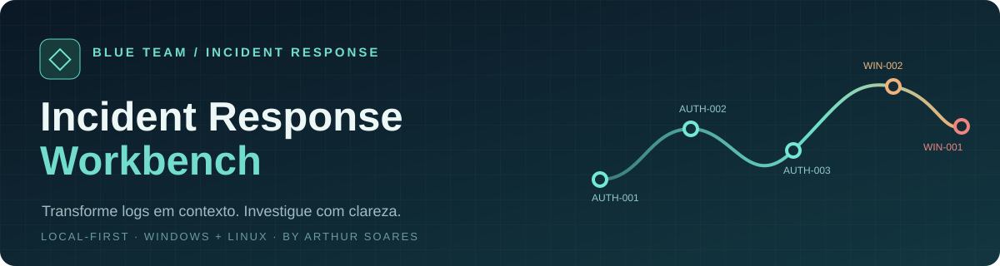

<div align="center">



# Incident Response Workbench

**Uma estação de triagem de logs Windows e Linux — simples de abrir, útil para investigar, honesta sobre seus limites.**

[](https://github.com/ArthurCybSec/Incident-Response-Workbench/actions/workflows/ci.yml)


</div>

## Comece em menos de um minuto

1. Clique em **Code → Download ZIP** nesta página.
2. Extraia o arquivo ZIP.
3. Abra **`index.html`** com dois cliques, usando Chrome, Edge ou Firefox atualizado.
4. Clique em **Carregar caso de demonstração**. Selecione um evento para ler o motivo do alerta.

Não precisa instalar Python, Node, banco de dados ou cadastrar uma conta. O projeto funciona offline. Para analisar arquivos próprios, arraste-os para a área de importação ou clique para selecioná-los. Há dois exemplos em [`examples/`](examples/) para repetir o fluxo manualmente.

> **Privacidade:** os arquivos são lidos no seu navegador. O aplicativo não possui servidor, telemetria nem chamadas de rede. Não envie logs reais como issues públicas: eles podem conter nomes, IPs e outros dados sensíveis.

## O que ele faz

| Etapa | Funcionalidade |
| --- | --- |
| Importação | CSV e XML de eventos Windows; JSON de eventos; `auth.log`, `syslog` e texto Linux em formato syslog ou ISO 8601 |
| Triagem | Identifica falhas de autenticação, cinco ou mais falhas em 10 minutos, acesso após falhas e eventos relevantes de Windows/Linux |
| Investigação | Linha do tempo cronológica com busca, filtros, detalhes do registro original e explicação de cada regra |
| Documentação | Notas do analista e relatório HTML independente, imprimível em PDF; exportação completa em JSON e CSV |
| Segurança | Sem execução do conteúdo dos logs; HTML escapado; exportação CSV protegida contra fórmulas de planilhas |

### Cobertura inicial de regras

| Regra | Sinal | Prioridade |
| --- | --- | --- |
| `AUTH-001` | Falha de autenticação | Média |
| `AUTH-002` | 5+ falhas relacionadas em 10 minutos | Alta |
| `AUTH-003` | Login aceito após 3+ falhas relacionadas em 15 minutos | Alta |
| `WIN-001` | Evento 1102: log de auditoria limpo | Crítica |
| `WIN-002` | Evento 7045: novo serviço instalado | Alta |
| `WIN-003` / `WIN-004` | Criação de conta / inclusão em grupo privilegiado | Alta |
| `WIN-005` | Indicadores de comando codificado ou execução suspeita nos eventos 4104/4688 | Alta |
| `LNX-001` / `LNX-002` | Uso de `sudo` / criação de usuário | Média / Alta |

As correlações usam host, IP e usuário, quando disponíveis. A ausência desses campos reduz a precisão. Um alerta indica **prioridade de triagem, nunca confirmação automática de incidente**.

## Formatos aceitos e limites

- **Windows CSV:** cabeçalhos como `TimeCreated`, `EventID`, `Computer`, `TargetUserName`, `IpAddress`, `Message`; há equivalentes em português. CSV com vírgula ou ponto e vírgula é aceito.
- **Windows XML:** estrutura `<Events><Event>…</Event></Events>`, com `<System>` e `<EventData>` típicos do Event Log.
- **JSON:** lista de objetos de evento ou objeto com propriedade `events`.
- **Linux:** linhas syslog (`Sep 18 09:00:00 host processo: mensagem`) ou ISO 8601 (`2026-09-18T09:00:00-03:00 host processo: mensagem`). Para syslog sem ano, selecione o ano na interface.
- Limites: **5 MB por arquivo** e **10.000 eventos por caso**. Datas inválidas geram aviso e aparecem ao fim da linha do tempo.
- Arquivos `.evtx` binários **não são aceitos diretamente**; exporte os eventos em CSV, XML ou JSON antes de importar.
- A extração automática de endereços IP em texto reconhece IPv4 nesta versão; campos explícitos de IP em CSV/XML/JSON são preservados.

Horários são apresentados no fuso do navegador; o relatório mantém as datas normalizadas em ISO 8601. Confirme fuso, relógio e ano dos registros originais antes de correlacionar evidências.

## Como o caso de demonstração funciona

O conjunto sintético inclui uma sequência de falhas de login, acesso aceito posteriormente, instalação de serviço, limpeza de log, uso de `sudo` e um backup legítimo. Os IPs usam faixas reservadas para documentação (`192.0.2.0/24` e `198.51.100.0/24`). Nenhum dado real de terceiros foi usado.

## Desenvolvimento e testes

O aplicativo é HTML, CSS e JavaScript sem framework e sem build. [`src/core.js`](src/core.js) contém parsing, regras e geração de relatório; [`src/app.js`](src/app.js) cuida da interface. Os testes usam o runner nativo do Node:

```bash
node --test tests/core.test.js
```

Para quem desenvolve, `npm test` executa o mesmo conjunto. A CI roda os testes em Node 20 e 22 a cada push e pull request. **Node é necessário apenas para contribuir/testar o código, não para usar o aplicativo.**

## Limites éticos e técnicos

Esta é uma ferramenta de **triagem educacional**, não um SIEM, EDR ou solução forense certificada. Ela não coleta logs, não consulta reputação externa, não verifica integridade criptográfica nem preserva cadeia de custódia. Regras textuais podem gerar falsos positivos e não detectam todas as técnicas. Preserve os arquivos originais e valide hipóteses com outras evidências antes de tomar qualquer medida operacional.

---

Desenvolvido por **[Arthur Soares](https://github.com/ArthurCybSec)** para demonstrar análise de logs, correlação de eventos, documentação de investigação e uma experiência acessível a iniciantes.
